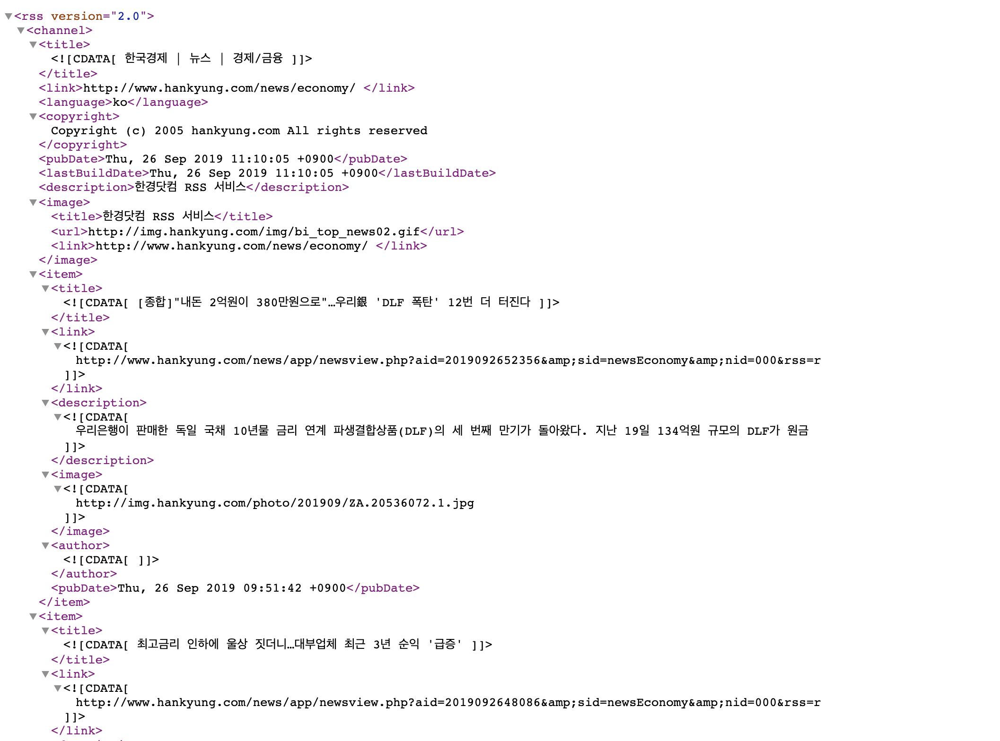

# new_parsing
news parsing using nodejs


1. 언론사 API 사용하기


2. 예시 한국경제 신문 코드
```javascript
const request = require('request');
const fs = require('fs');
const parseString = require('xml2js').parseString;
const date = new Date();
module.exports = ()=>{
    let arr = {};   
    let arr2 = {};
    request.get('http://rss.hankyung.com/new/news_economy.xml', (err,res,body)=>{
        if(err){
            return console.error(err);
        }
        
        parseString(body, {trim:true} ,(err,result)=>{
            if(err){
                console.error(err);
            }
            arr = result.rss.channel[0].item;
        });
        // console.log(arr);
        arr2 = arr.map((item,index)=>(
`       
${index+1} 제목 : ${item.title}  
요약: ${item.description}
링크: ${item.link}`

        ));
                
        // console.log(arr2);
        fs.writeFile(`./${date.getMonth()+1}월${date.getDate()}일한경.txt`, arr2, 'utf8',function(err) {
            if(err) {
                return console.log(err);
            }
        
            console.log("The file was saved!");
        });  
    });
            
}
```
3. main app code
```javascript
const request = require('request');
const parseString = require('xml2js').parseString;
const fs = require('fs');
const date = new Date();
const saveNews = require('./models');

saveNews();
 

```
